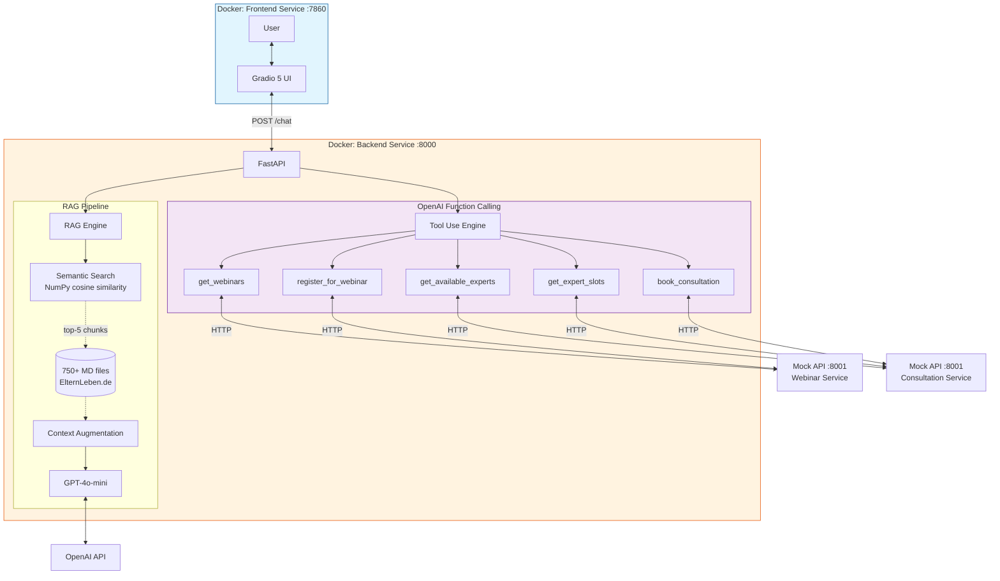
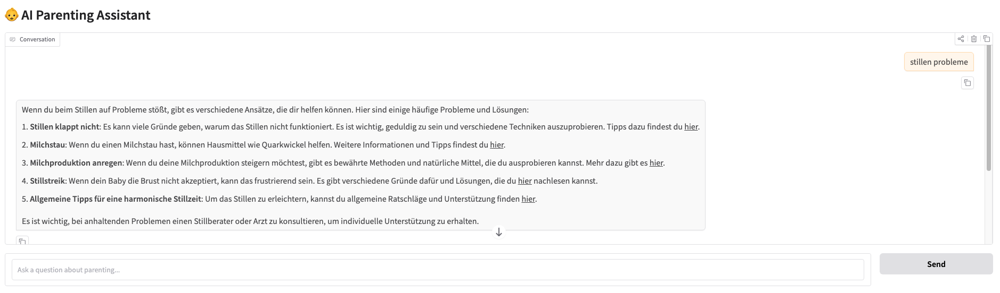

# 👶 AI Parenting Assistant — ElternLeben.de

> Expert-backed parenting guidance, available 24/7 — built for the **AI for Impact Hackathon** in Germany.

---

## 🌍 Social Impact

In Germany, professional parenting counselling is expensive, slow, and often inaccessible at the moments parents need it most — like 2 AM when a baby won't stop crying.

**[ElternLeben.de](https://www.elternleben.de/)** is a non-profit with 750+ expert-vetted articles and a team of certified counsellors. The knowledge exists. But parents can't search it — they can only browse.

This project makes that expertise conversational, instant, and free.

| What it solves | How |
|---|---|
| Information overload from contradictory online advice | Every answer is grounded in ElternLeben's verified expert content |
| Professional counselling gatekept by cost and availability | Free, 24/7, no appointment needed |
| Generic AI that parents can't trust | Every response cites the original source article |
| Distance between content and services | Parents can book consultations and register for webinars directly in chat |

> High-quality parenting guidance in Germany is expensive and gatekept. This makes it accessible.

---

## 🚀 Key Features

### 1. RAG-Powered Answers
Responses are grounded in 750+ expert articles from ElternLeben.de using Retrieval-Augmented Generation — not generic LLM knowledge. Every answer cites the original source URL so parents can verify the advice themselves.

### 2. Source Attribution
Each response includes clickable links to the original ElternLeben.de articles. This is the core trust mechanism — it's not just a feature, it's what makes parents willing to act on the advice.

### 3. Service Integration via Tool Use
The assistant seamlessly transitions from answering questions to completing real service actions — using OpenAI function calling to connect with the ElternLeben service ecosystem:

- **Webinar registration** — discover upcoming seminars and register within the chat
- **Consultation booking** — find available experts, browse time slots, and confirm appointments through a guided multi-turn conversation

### 4. Full Docker Deployment
Two-container architecture with Docker Compose. The frontend and backend run as independent services — production-ready structure from day one.

---

## 🏗️ System Architecture


```mermaid
flowchart TD
    subgraph Frontend [Docker: Frontend Service :7860]
        A[User] <--> B[Gradio 5 UI]
    end

    subgraph Backend [Docker: Backend Service :8000]
        B <-->|POST /chat| C[FastAPI]
        C --> D[RAG Engine]

        subgraph RAG [RAG Pipeline]
            D --> E[Semantic Search\nNumPy cosine similarity]
            E -.->|top-5 chunks| F[(750+ MD files\nElternLeben.de)]
            F -.-> G[Context Augmentation]
            G --> H[GPT-4o-mini]
        end

        C --> I[Tool Use Engine]
        subgraph Tools [OpenAI Function Calling]
            I --> J[get_webinars]
            I --> K[register_for_webinar]
            I --> L[get_available_experts]
            I --> M[get_expert_slots]
            I --> N[book_consultation]
        end
    end

    H <--> O[OpenAI API]
    J & K <-->|HTTP| P[Mock API :8001\nWebinar Service]
    L & M & N <-->|HTTP| Q[Mock API :8001\nConsultation Service]

    style Frontend fill:#e1f5fe,stroke:#01579b
    style Backend fill:#fff3e0,stroke:#e65100
    style Tools fill:#f3e5f5,stroke:#6a1b9a
```

---

## 🧠 Tech Stack

| Layer | Technology |
|---|---|
| LLM | GPT-4o-mini |
| Embeddings | OpenAI text-embedding-3-small |
| Vector Search | NumPy cosine similarity (in-memory) |
| Service Integration | OpenAI Function Calling |
| Backend | FastAPI (Python 3.10+) |
| Frontend | Gradio 5.x |
| Orchestration | Docker Compose (2 containers) |
| Mock Services | FastAPI + SQLite (Webinar & Consultation API) |
| Data | 750+ Markdown files — ElternLeben.de |

---

## 💬 Demo



---

## ⚙️ Setup & Installation

### Prerequisites
- Docker Desktop
- OpenAI API key

### 1. Clone the repository

```bash
git clone https://github.com/jeannineshiu/ai-parenting-chatbot.git
cd ai-parenting-chatbot
```

### 2. Configure environment variables

```bash
cp .env.example .env
# Add your OpenAI API key to .env
```

### 3. Generate the embedding cache (first run only)

The embedding cache must be built on the host before starting Docker, as the backend requires internet access to call the OpenAI embeddings API:

```bash
pip install openai numpy python-dotenv
python3 -c "
import sys; sys.path.insert(0, 'backend')
from rag import load_documents
docs = load_documents('data')
print(f'Loaded {len(docs)} docs')
"
```

This takes a few minutes and only needs to run once.

### 4. Launch with Docker

```bash
docker compose up --build
```

### 5. (Optional) Run the Mock Service API

For service integration features (webinar registration, consultation booking):

```bash
git clone https://github.com/n3xtcoder/ai4impact-elternleben.git
cd ai4impact-elternleben/mock_api
pip install fastapi uvicorn sqlalchemy pydantic python-multipart
python create_database.py
uvicorn mock_api:app --reload --port 8001
```

### 6. Access the assistant

| Service | URL |
|---|---|
| Chat UI | http://localhost:7860 |
| Backend API docs | http://localhost:8000/docs |
| Mock Service API docs | http://localhost:8001/docs |

---

## 📂 Project Structure

```
├── backend/
│   ├── main.py              # FastAPI endpoints + tool use logic
│   ├── rag.py               # Embedding, chunking, semantic search
│   ├── embedding_cache.json # Pre-computed embeddings (generated locally)
│   └── requirements.txt
├── frontend/
│   └── app.py               # Gradio 5 chat interface
├── eval/
│   ├── build_testset.py     # Generates questions + reference answers from articles
│   ├── testset.json         # 20 hand-reviewed evaluation samples
│   ├── run_ragas.py         # Runs the chat pipeline and scores it with RAGAS
│   └── results/             # Timestamped runs (summary.json + samples.csv)
├── data/                    # 750+ Markdown articles from ElternLeben.de
├── docker-compose.yml
└── .env.example
```

---

## 📊 RAG Evaluation (RAGAS)

The retrieval and generation quality is measured with [RAGAS](https://docs.ragas.io/) on 20 questions spanning pregnancy, babies, toddlers, school kids, teenagers and parental health.

### Results: evaluation-driven fix

The first evaluation exposed a context truncation bug. Each configuration was run **3 times** (mean ± std) because LLM-judge scores vary between runs.

| Metric | Before (500 chars/chunk) | After (full chunks) | What it measures |
|---|---|---|---|
| Faithfulness | 0.68 ± 0.04 | **0.88 ± 0.01** | Share of claims in the answer supported by the retrieved context |
| Context Recall | 0.59 ± 0.02 | **0.94 ± 0.02** | How much of the reference answer is covered by the retrieved context |
| Context Precision | 0.80 ± 0.04 | **0.91 ± 0.01** | Whether relevant chunks are ranked at the top |
| Answer Relevancy | 0.74 ± 0.00 | 0.74 ± 0.00 | How directly the answer addresses the question |
| Hit Rate@5 | 0.90 | 0.90 | Source article appears in the top-5 retrieved chunks (no LLM) |
| MRR | 0.80 | 0.80 | Mean reciprocal rank of the source article (no LLM) |

Generator `gpt-4o-mini` · Judge `gpt-4o` · Embeddings `text-embedding-3-small` · All runs: [`eval/results/`](eval/results/)

**Diagnosis.** Retrieval already found the right article (hit rate 0.90), yet faithfulness and recall were low. **93% of chunks were longer than the 500 characters passed to the model** (median ≈ 1,000), so the model saw only the first half of each chunk and filled the gaps with general knowledge. For the SIDS question the correct article ranked #1, but context recall was 0.07 and faithfulness 0.24 — the concrete recommendations (room temperature 16–18 °C, sleeping bag, no hat) were in the truncated half.

**Fix.** Pass whole chunks (`CONTEXT_CHARS = None` in `backend/main.py`). The SIDS question went to recall 1.00 / faithfulness 0.88. Hit rate and MRR are unchanged, as expected — the retrieved chunks are identical, only how much of them the model sees changed. Context precision rose too because the judge scores the same truncated text: with whole chunks it can recognise relevant ones it previously could not.

**Remaining weak spots.** Faithfulness is still ≈0.6–0.7 on teething, parental burnout and stuttering; the stuttering article is not retrieved in the top 5 at all. These are the next targets (hybrid search, prompt tightening).

### Methodology notes
- **Same pipeline as production** — the evaluation calls `run_chat()` in `backend/main.py`, the exact function behind `/chat`.
- **Stronger judge than generator** — `gpt-4o` scores the `gpt-4o-mini` answers to reduce self-preference bias. Reference answers were also written by `gpt-4o` from the source article and spot-checked by hand.
- **German prompt adaptation** — RAGAS prompts are English by default. Answer Relevancy generates questions back from the answer and compares embeddings with the user's question; English questions against German input scored 0.27 on a clearly relevant answer, 0.82 after adapting the prompts to German.
- **Limitations** — 20 samples, single-turn only, and LLM-judge scores vary by a few points between runs. Questions were generated from single articles, which favours retrieval compared to real user questions.

### Run it yourself

```bash
uv venv .venv-eval --python 3.12
uv pip install --python .venv-eval/bin/python -r eval/requirements.txt
.venv-eval/bin/python eval/run_ragas.py            # full run (20 questions)
.venv-eval/bin/python eval/run_ragas.py --limit 3  # quick smoke test

# Compare configurations over repeated runs
.venv-eval/bin/python eval/run_ragas.py --context-chars 500 --label ctx500
.venv-eval/bin/python eval/compare_runs.py ctx500 ctxfull
```

The evaluation dependencies live in a separate environment so the backend image stays small.

---

## 🔍 Technical Design Decisions

### NumPy over a Vector Database
At 750 documents (~4,800 chunks), batch cosine similarity with NumPy is fast enough. FAISS or ChromaDB pays off at 50K+ documents. Simplicity wins at this scale. The right time to add complexity is when the data grows, not when building the first version.

### URL extraction before text cleaning
Each Markdown file contains a YAML frontmatter block with the original ElternLeben.de URL. The pipeline extracts this URL *before* stripping the frontmatter, so every chunk retains its source link — enabling accurate citations even after the text is cleaned and split.

### Source attribution as a trust mechanism
The system prompt instructs the model to only use the provided context. The frontend always surfaces the source URLs. Showing the source is not just a feature — it's what makes parents willing to act on the advice, and it's what distinguishes this from a generic chatbot.

### Tool use for service routing
Rather than rule-based intent detection, the assistant uses OpenAI function calling to decide when to transition from information to services. The LLM determines when the user needs a webinar or consultation, collects required fields through natural conversation, and calls the appropriate API endpoint — creating a seamless flow between Q&A and real service actions.

---

## 🛣️ Roadmap

- [ ] **Hybrid Search** — Combine semantic search with BM25 for better handling of specific German parenting and medical terminology
- [ ] **Vector Database** — Migrate to ChromaDB for scalability as the knowledge base grows
- [x] **RAG Evaluation** — RAGAS baseline for Faithfulness, Answer Relevancy, Context Precision and Context Recall
- [x] **Context Window Tuning** — Pass full chunks instead of the first 500 characters (faithfulness 0.68 → 0.88)
- [ ] **Analytics Tracking** — Log service interaction events to surface insights for the ElternLeben team
- [ ] **Azure Deployment** — Production deployment via Azure Container Apps
